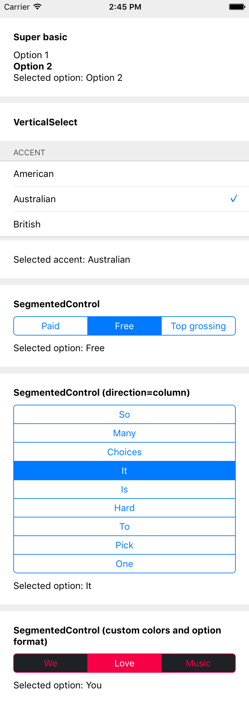

# react-native-radio-buttons

A react component to implement _radio buttons_-like behaviors: multiple options, only on can be selected at once.



## Install

```
npm i -S react-native-radio-buttons
```

## Demo app

```
git clone git@github.com:ArnaudRinquin/react-native-radio-buttons.git
cd react-native-buttons
npm install
open examples/examples.xcodeproj
```

And press `Cmd + R`

## Usage

Here is an extensive overview of the component usage.

```jsx

render() {
  const options = [
    "Option 1",
    "Option 2"
  ];

  function setSelectedOption(selectedOption){
    this.setState({
      selectedOption
    });
  };

  function renderOption(option, selected, onSelect, index){
    const style = selected ? { fontWeight: 'bold'} : {}

    return (
      <TouchableWithoutFeedback onPress={onSelect} key={index}>
        <Text style={style}>{option}</Text>
      </TouchableWithoutFeedback>
    );
  }

  function renderContainer(optionNodes){
    return <View>{optionNodes}</View>;
  }

  return (
    <View style={{margin: 20}}>
      <RadioButtons
        options={ options }
        onSelection={ setSelectedOption.bind(this) }
        selectedOption={this.state.selectedOption }
        renderOption={ renderOption }
        renderContainer={ renderContainer }
      />
      <Text>Selected option: {this.state.selectedOption || 'none'}</Text>
    </View>)
  ;
}

```

Will render this


## Props

* `options - []` mandatory array of anything, will be passed to `renderOption`
* `onSelection - function(option){}` option selection callback
* `selectedOption - option` the initially selected option, optional
* `renderOption - function(option, selected, onSelect, index)` should return an option node, default generate `<Text>` nodes and adds `{fontWieght:'bold'}` to the selected option.
* `renderContainer - function(optionsNodes)` must render the container, default is RadioButtons.renderVerticalContainer (see below)

## Helpers
**RadioButtons.renderVerticalContainer;**

A super simple `renderContainer` function that generates a <View> with `{flexDirection: "column"}`. It is used as default `rendeContainer` if you don't specify it.

Usage:
```
<RadioButtons
  options={ options }
  onSelection={ setSelectedOption }
  renderContainer={RadioButtons.renderVerticalContainer}
/>
```

**RadioButtons.renderHorizontalContainer;**

Another super simple `renderContainer` function that generates a <View> with `{flexDirection: "row"}`

Usage:
```
<RadioButtons
  options={ options }
  onSelection={ setSelectedOption }
  renderContainer={RadioButtons.renderHorizontalContainer}
/>
```

**RadioButtons.getViewContainerRenderer(viewCOntainerStyle);**

An helper that generates a simple `<View>` with the provided style.

Usage:
```
<RadioButtons
  options={ options }
  onSelection={ setSelectedOption }
  renderContainer={RadioButtons.getViewContainerRenderer({
    backgroundColor: '#f80046',
    flexDirection: 'row',
    justifyContent: 'space-around',
  })}
/>
```

**RadioButtons.getTextOptionRenderer(normalStyle, selectedStyle, extractText);**

An helper that generates `<Text>` options wrapped in `<TouchableWithoutFeedback>`.
`normalStyle` and `selectedStyle` will be applied to the <Text> nodes, depending on state. `extractText(options)` can be specified.


Usage:
```
const normalStyle = {
  color: 'white'
};

const selectedStyle = {
  color: '#f80046',
  fontWeight: 'bold'
};

const extractText = (option) => option.label;

<RadioButtons
  options={ options }
  onSelection={ setSelectedOption }
  renderOptions={RadioButtons.getTextOptionRenderer(normalStyle, selectedStyle, extractText)}
/>
```
